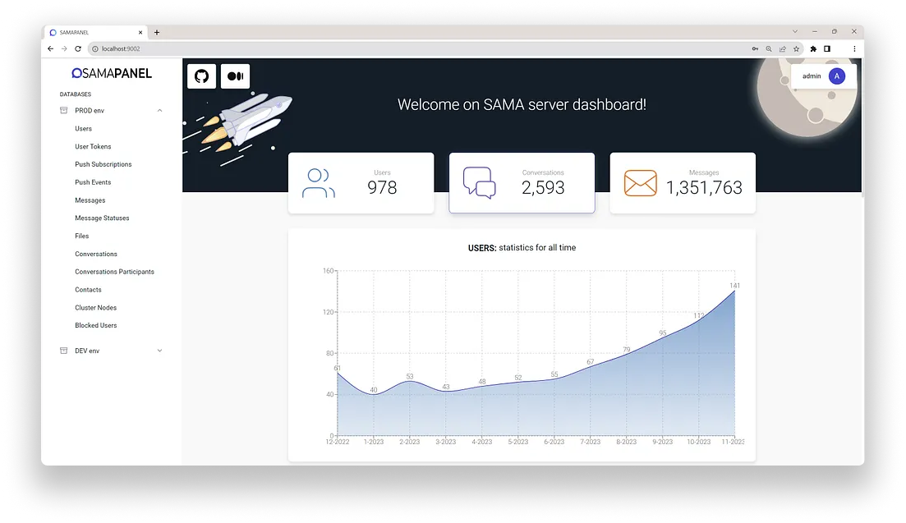

<br />

import { Breadcrumbs } from "astro-breadcrumbs";
import { Icon } from "@astrojs/starlight/components";

import "astro-breadcrumbs/breadcrumbs.css";

<Breadcrumbs
  linkTextFormat="capitalized"
  crumbs={[
    { href: "/" },
    { text: "API" },
    { text: "Features" },
    { text: "Dashboard" },
  ]}
>
  <Icon slot="index" name="seti:powershell" />
  <span slot="separator">&nbsp;&nbsp;/&nbsp;</span>
</Breadcrumbs>

---

## Introduction

<br />

> #### Powered by [`Adminjs`](https://github.com/SoftwareBrothers/adminjs) & [`Recharts`](https://github.com/recharts/recharts)

Our team has created a simple and accessible admin panel so you can view your data in one place.

import { LinkCard, Steps, Aside } from "@astrojs/starlight/components";

<LinkCard
  title="SAMA Server Dashboard - GitHub"
  href="https://github.com/SAMA-Communications/sama-server-dashboard"
  description="During the last month 📆, we have been implementing and testing a new authorization flow for our API."
/>

## Installation & Configuration

<Steps>

1.  To get started, go to the admin panel repository and copy.

    ```bash
    git clone https://github.com/SAMA-Communications/sama-server-dashboard.git
    ```

2.  Next, copy the contents of `.env.example` to `.env` and replace with your values.

3.  And now, launch the admin panel.

    ```bash
    npm run start
    ```

4.  Log in using the keys you set in .env and you will be taken to the home page (dashboard):

    

</Steps>

<Aside type="tip">
  If you want to discover more about the possibilities of the dashboard, please
  follow the link to the article below:
</Aside>
<LinkCard
  title="SAMA server dashboard"
  href="https://medium.com/sama-communications/sama-server-dashboard-9eae8c0d6c20"
  description="Everyone knows that as the number of users increases, so does the load on the system and the amount of stored data, and the question becomes..."
/>
