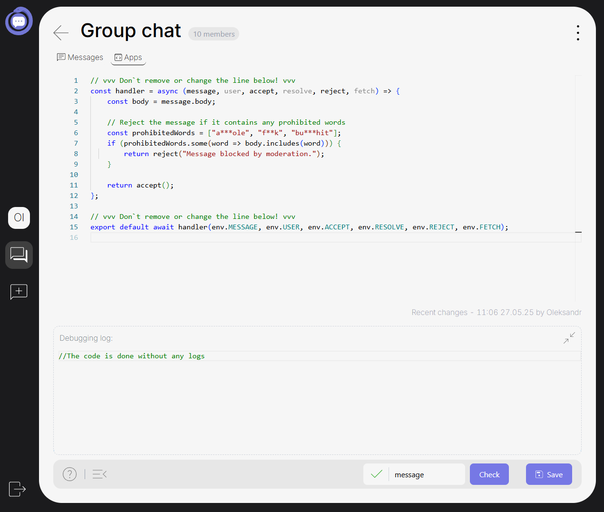

<br />

import { Breadcrumbs } from "astro-breadcrumbs";
import { Icon } from "@astrojs/starlight/components";

import "astro-breadcrumbs/breadcrumbs.css";

<Breadcrumbs
  linkTextFormat="capitalized"
  crumbs={[{ href: "/" }, { text: "Features" }, { text: "Programmable Chat" }]}
>
  <Icon slot="index" name="seti:powershell" />
  <span slot="separator">&nbsp;&nbsp;/&nbsp;</span>
</Breadcrumbs>

---

import { Tabs, TabItem, Steps } from "@astrojs/starlight/components";
import { Aside, Badge, LinkCard, Card } from "@astrojs/starlight/components";

## Introduction

This allows developers to inject custom JavaScript logic into the chat system and interact with messages in real time. Below you’ll find a full explanation of how this works, what tools are available, and how to write and test your own handler functions.



## What is Programmable Chat?

Programmable Chat enables message-level moderation, transformation, or dynamic response handling by attaching custom JavaScript code to your chat. It runs before a message is submitted to the database and allows for fine-grained control.

## Use Cases

You can customize how messages are processed using programmable logic. Common use cases include:

- **Message moderation** — Block messages with harmful content, profanity, or spoilers.
- **Content rewriting** — Automatically fix formatting, redact links, or normalize text (e.g., converting ALL CAPS to lowercase).
- **Auto-replies** — Respond to greetings, keywords, or help requests with custom messages.
- **Attachment injection** — Replace or respond to specific keywords with images, files, or other media attachments.
- **Spam filtering** — Detect and reject repetitive, all-caps, or link-heavy messages.
- **Dynamic interaction** — Modify messages in real time before they're shown, based on user input or context.

These use cases can be combined or expanded to tailor chat behavior to your community’s needs. And of course, you can always experiment with your own logic.

---

## Core Mechanics

Your custom code is structured as an **asynchronous handler function**, which receives several runtime parameters:

```jsx
const handler = async (message, user, accept, resolve, reject, fetch) => {
  // Your logic here
};
```

The following arguments are provided:

- `message`: The user’s message object
- `user`: The sender user object
- `accept()`: Approves the message (unchanged)
- `resolve(...)`: Replaces the message or responds on behalf of the bot
- `reject("reason")`: Blocks the message and shows an error to the user

\* _For more information about object fields, see:_

<LinkCard
  title="DataBase Records"
  href="http://localhost:4321/deployment/db-instances/"
/>

At the bottom of your script, you must always export the handler like this:

```jsx
export default await handler(
  env.MESSAGE,
  env.USER,
  env.ACCEPT,
  env.RESOLVE,
  env.REJECT,
  env.FETCH
);
```

<Aside type="caution" title="Attention">
  Do not remove or modify the export line or the handler declaration. These are
  required for execution.
</Aside>

## Available Actions

### `accept()`

- Approves and sends the message unchanged.
- Use when your logic determines that the message is safe or does not need to be changed.

```jsx
return accept();
```

### `resolve()`

- Same as `accept()` if called without arguments.

**With currently available parameters:**

```jsx
return resolve(
  {
    message: {
      body: "Rewritten message here",
      attachments: [
        {
          file_url: "https://example.com/file.png",
          file_blur_hash: "LEHV6nWB2yk8pyo0adR*.7kCMdnj",
          file_content_type: "image/png",
          file_width: 800,
          file_height: 600,
        },
      ],
    },
  },
  { isReplaceBody: true }
);
```

- If `isReplaceBody` is `true`, the original user message will be replaced with your version
- If omitted or `false`, your message will appear **as a bot response**.

### `reject("reason")`

- Blocks the message and shows the specified error string to the user.

```jsx
return reject("Message blocked due to inappropriate content.");
```

<br />

---

## Default Handler Example

Here is the default JavaScript example used for basic profanity filtering:

```jsx
// vvv Don`t remove or change the line below! vvv
const handler = async (message, user, accept, resolve, reject, fetch) => {
  const body = message.body;

  // Reject the message if it contains any prohibited words
  const prohibitedWords = ["asshole", "fuck", "bullshit"];
  if (prohibitedWords.some((word) => body.includes(word))) {
    return reject("Message blocked by moderation.");
  }

  return accept();
};

// vvv Don`t remove or change the line below! vvv
export default await handler(
  env.MESSAGE,
  env.USER,
  env.ACCEPT,
  env.RESOLVE,
  env.REJECT,
  env.FETCH
);
```

<Aside title="Info">
  This handler checks for banned words and rejects the message if any are found.
  Otherwise, it allows the message through.
</Aside>

## Testing the Code

You can test your logic directly on the page using the **Check** button:

- Type a test message in the input field
- Click **Check** to simulate a message being sent
- Check the logs for output

<Aside>

- Tests are executed **client-side**
- External requests (e.g., `fetch`) may **fail due to CORS** restrictions — this is expected
- If validation passes (green indicators) but something still fails, report the issue via [Discord](https://discord.gg/ye68KMgA2f) or [GitHub](https://github.com/SAMA-Communications/sama-server/issues)

</Aside>

## Managing Your Script

- **Save**
  - Saves your current code to be executed on live messages.
- **Options Dropdown**
  - **Delete**: Removes the current chat handler entirely
  - **Undo**: Restores the default code sample

## Tips & Warnings

- **Do not remove** the header or footer lines:
  ```jsx
  // vvv Don’t remove or change the line below! vvv
  ```
- Only one call (`accept`, `resolve`, or `reject`) should be made per message
- `resolve` with `isReplaceBody: true` is useful for:
  - Redacting sensitive words
  - Auto-formatting markdown or links
- Avoid relying on `fetch` in test mode — use saved code to verify external logic

## FAQ

<Card title="Q: How do I block messages with bad words?" icon="open-book">
    >A: Use an array of words and check with `.some()` like in the default handler.
</Card>
<Card title="Q: Can I rewrite user messages?" icon="open-book">
    >A: Yes. Use `resolve({message: { body: "..." }}, { isReplaceBody: true })`.
</Card>
<Card title="Q: Can I send attachments?" icon="open-book">
    >A: Yes, inside the `attachments` array in the `message` object.
</Card>
<Card title="Q: Can I call APIs or use async functions?" icon="open-book">
    >A: Yes, but be cautious with CORS and always test in production mode.
</Card>
<Card title="Q: Can I use external libraries or APIs?" icon="open-book">
    >A: You can use `fetch` to call external APIs or services, but only in the saved handler — not during test mode, due to browser CORS restrictions. However, importing external JavaScript libraries (e.g., using `import` statements, CDN scripts, or npm packages) is **not supported**. You must rely on built-in JavaScript and browser APIs only.
</Card>

## Examples

<Steps>

1. ### 👋 Auto-Greeting Detection

   Responds with a welcome message when the user says hello.

   ```jsx
   const handler = async (message, user, accept, resolve, reject, fetch) => {
     const greetings = ["hi", "hello", "hey", "yo"];
     const body = message.body.toLowerCase();

     if (greetings.some((g) => body.startsWith(g))) {
       return resolve({
         message: {
           body: `Hi ${
             user.first_name || "there"
           }! 👋 How can I help you today?`,
         },
       });
     }

     return accept();
   };
   ```

2. ### 🖼️ Replace Keyword with Image Attachment

   If the user types `:cat:`, send a cat image and replace their message.

   ```jsx
   const handler = async (message, user, accept, resolve, reject, fetch) => {
     if (message.body.trim() === ":cat:") {
       const res = await fetch("https://api.thecatapi.com/v1/images/search");
       const cat = (await res.json())[0];
       return resolve(
         {
           message: {
             body: "Here's a cat for you! 🐱",
             attachments: [
               {
                 file_url: cat.url,
                 file_content_type: "image/jpeg",
                 file_width: cat.width,
                 file_height: cat.height,
               },
             ],
           },
         },
         { isReplaceBody: true }
       );
     }

     return accept();
   };
   ```

3. ### 🕵️‍♂️ Spoiler Filter

   Blocks messages that mention spoilers.

   ```jsx
   const handler = async (message, user, accept, resolve, reject, fetch) => {
     const body = message.body.toLowerCase();
     const spoilers = [
       "snape kills dumbledore",
       "bruce willis was dead",
       "tony dies",
     ];

     if (spoilers.some((line) => body.includes(line))) {
       return reject("🚫 Spoiler detected! Your message was blocked.");
     }

     return accept();
   };
   ```

4. ### 🔗 Replace All Links with "[link]"

   Detects and redacts URLs in the message text.

   ```jsx
   const handler = async (message, user, accept, resolve, reject, fetch) => {
     const urlRegex = /https?:\/\/[^\s]+/g;
     const newBody = message.body.replace(urlRegex, "[link]");

     return resolve({ message: { body: newBody } }, { isReplaceBody: true });
   };
   ```

5. ### 🔊 Normalize Caps Lock

   If the user is shouting in all caps, convert the message to lowercase.

   ```jsx
   const handler = async (message, user, accept, resolve, reject, fetch) => {
     const body = message.body;

     if (body === body.toUpperCase() && body.length > 5) {
       return resolve(
         {
           message: { body: body.toLowerCase() },
         },
         { isReplaceBody: true }
       );
     }

     return accept();
   };
   ```

6. ### ✨ Auto-format Messages

   Replaces `:emoji:` style codes with actual emojis.

   ```jsx
   const handler = async (message, user, accept, resolve, reject, fetch) => {
     const body = message.body;
     const transformed = body
       .replace(/:smile:/g, "😄")
       .replace(/:fire:/g, "🔥");

     return resolve(
       { message: { body: transformed } },
       { isReplaceBody: true }
     );
   };
   ```

7. > ✏️ Want more examples or want to share your own? Let us know in [Discord](https://discord.gg/ye68KMgA2f) or contribute via [GitHub](https://github.com/SAMA-Communications/programmable-chat).

</Steps>

<LinkCard
  title="GitHub - SAMA-Communications/programmable-chat"
  href="https://github.com/SAMA-Communications/programmable-chat"
  description="A set of ready chat handlers for programmable chat feature demo"
/>


## See Also

<LinkCard
  title="Notion: Programmable Chat Feature"
  href="https://oleksandr-ch.notion.site/Programmable-Chat-feature-1ffe3b41e4ae804da619f63b706e7263"
/>
<LinkCard
  title="Introducing Programmable Chat"
  href="https://medium.com/sama-communications/introducing-programmable-chat-8bfbc7728280"
  description="SAMA chat just got a powerful 💪🏻 upgrade. With our new Programmable Chat feature, you can now extend conversations with your own JavaScript logic."
/>

<script
  src="https://giscus.app/client.js"
  data-repo="Oleksandr1414/cathedra-slytherin"
  data-repo-id="R_kgDOI8uafg"
  data-category="[ВВЕДІТЬ CATEGORY NAME]"
  data-category-id="[ВВЕДІТЬ CATEGORY ID]"
  data-mapping="pathname"
  data-strict="0"
  data-reactions-enabled="1"
  data-emit-metadata="0"
  data-input-position="bottom"
  data-theme="transparent_dark"
  data-lang="uk"
  crossorigin="anonymous"
  async
></script>
