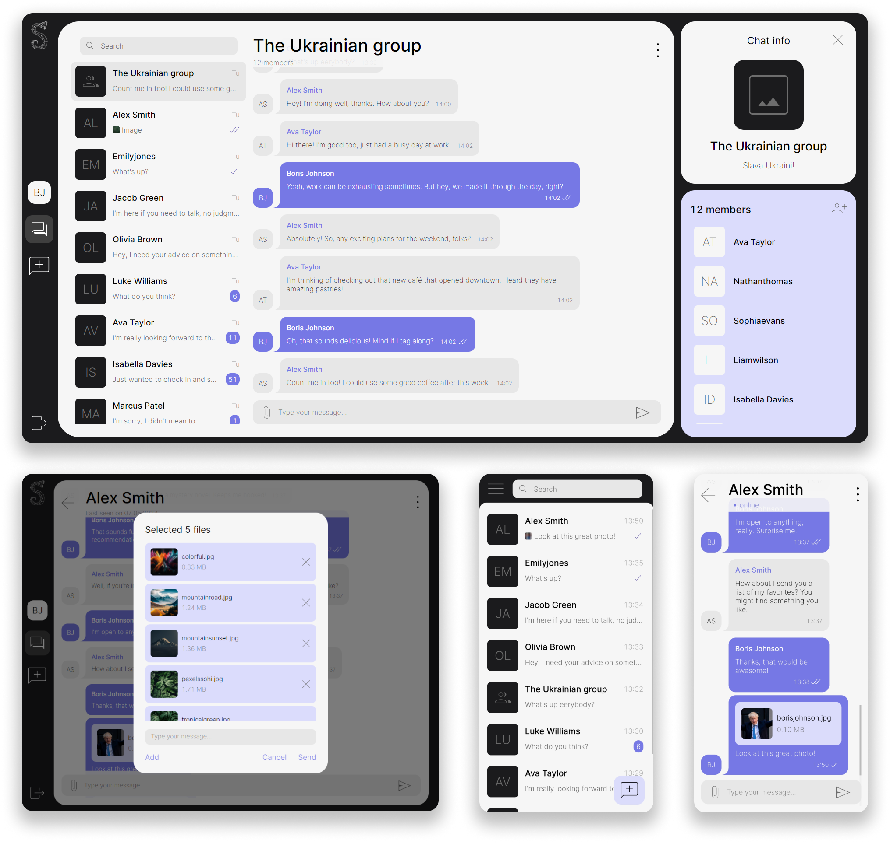

 

import { Breadcrumbs } from "astro-breadcrumbs";
import { Icon } from "@astrojs/starlight/components";

import "astro-breadcrumbs/breadcrumbs.css";

<Breadcrumbs
  linkTextFormat="capitalized"
  crumbs={[{ href: "/" }, { text: "Overview" }, { text: "Introduction" }]}
>
  <Icon slot="index" name="seti:powershell" />
  &nbsp;&nbsp;/&nbsp;
</Breadcrumbs>

---

import BuyMeACoffee from "../../../../assets/icons/buy-me-a-coffee.svg";

## Introduction

import { Card, CardGrid } from "@astrojs/starlight/components";
import { LinkCard, LinkButton } from "@astrojs/starlight/components";

The intention of our messaging protocol and chat server, which are different from others, is to provide an alternative solution to the wide spread XMPP messaging protocol (and to be honest — the only wide spread ‘standard’ these days).

Read complete medium posts **Introducing SAMA** and **What is SAMA** about what is SAMA and what problems we are trying to solve with it:

<LinkCard
  title="Introducing SAMA — Simple but Advanced Messaging Alternative chat server"
  target="_blank"
  href="https://medium.com/sama-communications/introducing-sama-simple-but-advanced-messaging-alternative-chat-server-524a532e2040"
  description="If you’re tired of using complicated chat servers with too many features that you don’t use.."
/>
<LinkCard
  title="What is SAMA?"
  target="_blank"
  href="https://medium.com/sama-communications/what-is-sama-a6d9045fd69a"
  description="In this article, we aim to provide developers with a thorough understanding of SAMA, its components, and its benefits for building powerful chat applications 😉."
/>
<LinkCard
  title="SAMA: chat server tech stack"
  target="_blank"
  href="https://medium.com/sama-communications/sama-chat-server-tech-stack-2ebfba71367b"
  description="In the world of real-time communication, chat servers play a vital role in connecting people across various platforms. To build a robust and scalable chat server, selecting the right technology stack is crucial."
/>

Clients:

<CardGrid>
  <LinkCard
    title="Frontend Web app"
    target="_blank"
    href="https://github.com/SAMA-Communications/sama-client"
  />
  <LinkCard
    title="Flutter app"
    target="_blank"
    href="https://github.com/SAMA-Communications/sama-client-flutter"
  />
</CardGrid>

## Features

- **Real-time Messaging**: Instant messaging with rich media support.
- **Group Chats**: Create and manage private and group chats.
- **User Management**: Comprehensive user management including authentication, profile editing, and search capabilities.
- **Multi-Device Support**: Seamless messaging across multiple devices.
- **Push Notifications**: Stay updated with messages via push notifications.
- **Clustering**: Built-in support for high availability and scalability.
- **Extensive API**: Powerful APIs for developers to integrate and extend functionality.

## Community and Support

Join our community for support and discussions:

- [GitHub Issues - SAMA server](https://github.com/SAMA-Communications/sama-server/issues), [GitHub Issues - SAMA client](https://github.com/SAMA-Communications/sama-client/issues)
- [SAMA on Medium](https://medium.com/sama-communications)
- Get help - [Discord 💬](https://discord.gg/bHSm9a7DpC)

## Help Us!

Stay connected and contribute to making SAMA even better! Any thoughts, feedback is welcome! Please create a GitHub issue for any feedback you have.

Want to support us?

<LinkButton
  target="_blank"
  href="https://www.buymeacoffee.com/khomenkoigor"
  variant="secondary"
>
  <BuyMeACoffee style="width: 16px; height:16px; margin-right: 0.5rem" /> Buy Me
  A Coffee
</LinkButton>

 

## Useful Links

<LinkCard
  title="SAMA-Communications"
  target="_blank"
  href="https://github.com/SAMA-Communications"
  description="Next-Gen open source chat platform: scalable chat server built with clustering support and programmable chat capabilities, modern Web and mobile clients."
/>
<LinkCard
  title="What is SAMA?"
  target="_blank"
  href="https://medium.com/sama-communications/what-is-sama-a6d9045fd69a"
  description="In this article, we aim to provide developers with a thorough understanding of SAMA, its components, and its benefits for building powerful chat applications 😉."
/>
<LinkCard
  title="Introducing SAMA — Simple but Advanced Messaging Alternative chat server"
  target="_blank"
  href="https://medium.com/sama-communications/introducing-sama-simple-but-advanced-messaging-alternative-chat-server-524a532e2040"
  description="If you’re tired of using complicated chat servers with too many features that you don’t use, or if you’re looking for a more intuitive and comprehensive chat platform, then..."
/>
